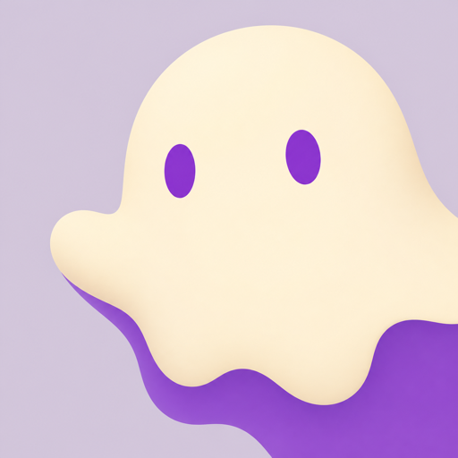
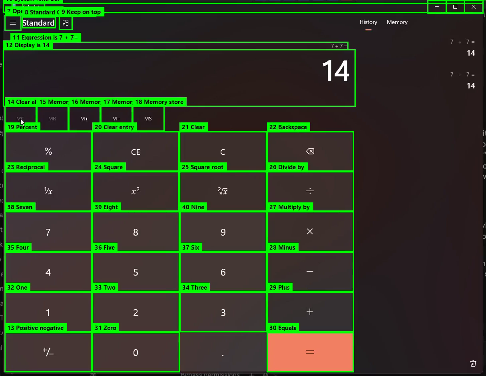
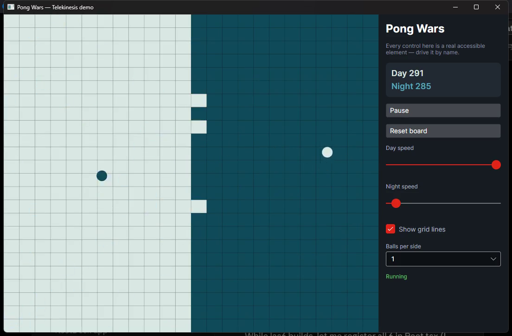
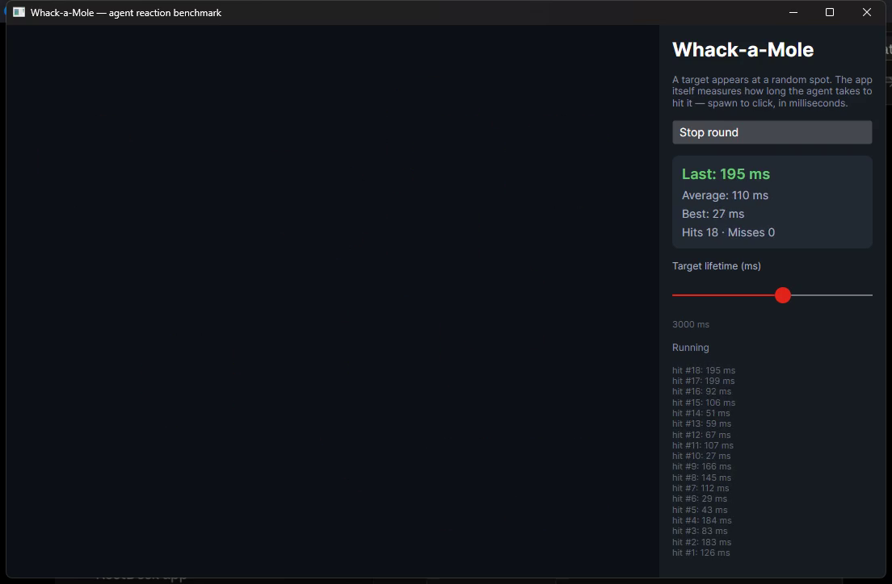
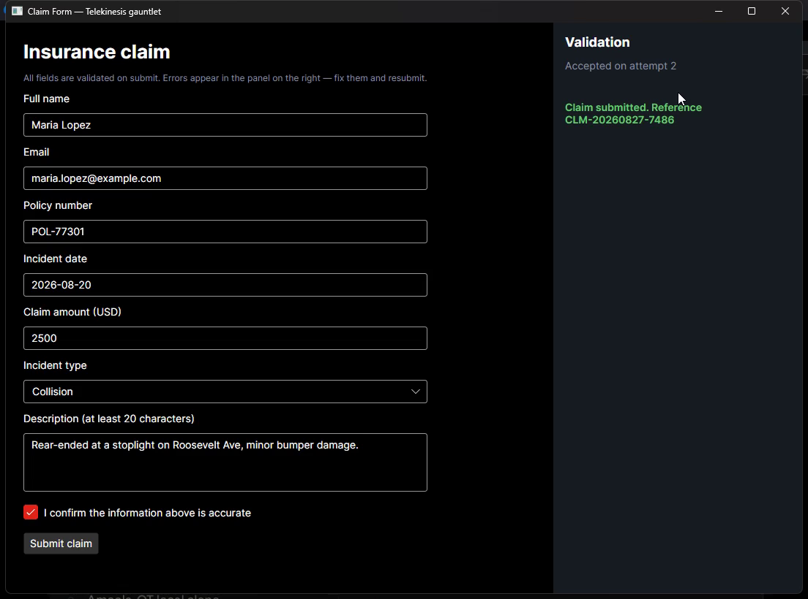

# Telekinesis



**Move things without touching them.** Telekinesis is an MCP server that lets AI agents
see and control the desktop through the platform accessibility APIs — the same channel
screen readers use. Semantic perception ("the Save button") instead of pixel-guessing,
at a fraction of the cost of screenshot-driven computer use.

**Watch it work** (YouTube Shorts — click to play):

| [](https://youtube.com/shorts/Tv_lZBmAVGI) | [](https://youtube.com/shorts/-a5_3NY6MuI) | [](https://youtube.com/shorts/fsNQ3THudmk) | [](https://youtube.com/shorts/BxQB6I0dPco) |
|:---:|:---:|:---:|:---:|
| [The helpful ghost](https://youtube.com/shorts/Tv_lZBmAVGI) | [Three apps, zero screenshots](https://youtube.com/shorts/-a5_3NY6MuI) | [The principle](https://youtube.com/shorts/fsNQ3THudmk) | [Install & wire it up](https://youtube.com/shorts/BxQB6I0dPco) |

```
dotnet tool install -g Telekinesis
```

No .NET on the machine? Grab a self-contained single-file build from the
[releases page](https://github.com/egarim/telekinesis/releases) — Windows/Linux/macOS,
x64 and arm64, no runtime required. (The dotnet-tool route does need the .NET 10
runtime, plus the Windows Desktop runtime on Windows.)

MCP client config:

```json
{ "mcpServers": { "telekinesis": { "command": "telekinesis" } } }
```

## Modes

- **Clairvoyant mode** (`telekinesis --read-only`) — perception only: `list_applications`,
  `get_tree`, `find_elements`, `read_element`, `get_focused`. Safe to expose; needs no
  input permissions. Password-field content is never exposed.
- **Telekinesis mode** (default) — adds actions: `invoke`, `set_text`, `click`,
  `type_text`, `press_keys`, `click_at`. Each action tries the native accessibility
  action first and falls back to OS input injection, reporting which path ran. Every
  action is audit-logged.
- **Vision tier** (last resort) — for the moments when the accessibility tree fails:
  `screenshot` captures pixels, `parse_screen` turns them into clickable elements via
  an optional [OmniParser](https://github.com/microsoft/OmniParser) sidecar, and
  `click_at` acts on them. Screens seen before answer instantly from
  [perceptual memory](docs/PERCEPTUAL-MEMORY.md), which also learns the targets that
  worked (`recall_targets`) and exports them as a training-ready dataset. See
  [docs/VISION.md](docs/VISION.md).
- **Browsers, first-class** — the web comes through the same tree: `read_page`
  snapshots a page (reading text + links/buttons/fields with actionable ids),
  `find_elements` scopes to `page` or `chrome` so browser UI stops shadowing page
  content, and `navigate` loads a URL. No browser driver, no CDP, no scraping. See
  [docs/BROWSERS.md](docs/BROWSERS.md).
- **Provider plugins** — app-matched fidelity behind the same interface: a registry
  resolves each application to the highest-priority provider that claims it (the
  browser provider un-shadows page content by default; the vision tier is the built-in
  fallback provider). External plugins load only by explicit opt-in and are flagged by
  `doctor`. See [docs/PROVIDERS.md](docs/PROVIDERS.md).
- **Medium (coming)** — build accessible apps for *humans and AI agents*: an SDK +
  semantic layer that lets an app enrich the accessibility tree with stable IDs, intent,
  risk, and confirmation requirements, merged onto the same element model. See
  [docs/MEDIUM.md](docs/MEDIUM.md).- **X-ray overlay** — see what the AI sees, on the real desktop: `highlight` boxes an
  element, `probe --overlay` draws live labeled boxes over a whole app, and
  `TELEKINESIS_SHOW_INTENT=1` makes every injected action flash its target before the
  input lands. Click-through, never steals focus. See [docs/XRAY-OVERLAY.md](docs/XRAY-OVERLAY.md).

[](docs/media/xray-overlay-demo.mp4)

*The X-ray overlay over Calculator — every element the ghost can see, boxed and labeled
live; then it computes 7+7 with each click telegraphed
([video](docs/media/xray-overlay-demo.mp4)).*

## Platform backends

| OS | Perception | Actions | Status |
|---|---|---|---|
| Linux | AT-SPI over D-Bus (Tmds.DBus.Protocol) — list, tree, find, states, bounds, text | AT-SPI Action/EditableText/Value → uinput fallback | perception + actions done; focus/events next |
| Windows | UI Automation (managed UIA client) — list, tree, find, states, bounds, text | UIA Invoke/Value/Toggle/RangeValue → SendInput fallback | perception + actions + events validated live ([notes](docs/RUNNING-ON-WINDOWS.md)) |
| macOS | AXAPI | AXPress → CGEvent | planned |

> Actions are implemented against the spec but await runtime testing on a Linux
> desktop session with `/dev/uinput` access.

All backends implement `IAccessibilityBackend` from `Telekinesis.Abstractions`, with a
normalized role/state vocabulary (UIA-modeled); the native role is always preserved in
`NativeRole` for when the abstraction leaks.

Uno Platform apps on Linux become visible to Telekinesis via
[uno-atspi-bridge](https://github.com/egarim/uno-atspi-bridge), which publishes Uno's
`AutomationPeer` tree onto the accessibility bus.

## Samples — real apps, driven live

Three Avalonia stress-test apps live in [`samples/`](samples/), each with a recorded
session of Telekinesis driving it (all native patterns, verified by read-back):

| | | |
|:---:|:---:|:---:|
| [](samples/PongWars) | [](samples/WhackAMole) | [](samples/FormGauntlet) |
| [**PongWars**](samples/PongWars) — drive the controls around an a11y-opaque canvas | [**WhackAMole**](samples/WhackAMole) — reaction benchmark: 46/0 hits, avg **110 ms**, best **27 ms** | [**FormGauntlet**](samples/FormGauntlet) — fill → rejected → read the errors → accepted |

## Scripted demos, CI, and remote use

`telekinesis run demos/<scenario>.json --enable-actions` executes a self-verifying
scripted demo with caption output (see [demos/](demos/)); `telekinesis assert` gives
shell scripts a 0/1 exit probe for UI conditions. The **headless one-shot CLI**
(`telekinesis apps|tree|find|read|focused|snapshot|launch|click|invoke|set-text|type|press`)
makes every perception and action a single JSON-printing process — drive a desktop over
plain SSH with no MCP client, including `launch` into the interactive session on
Windows ([docs/HEADLESS-CLI.md](docs/HEADLESS-CLI.md)). For remote clients,
`telekinesis serve --sse` speaks MCP over HTTP on localhost — read-only unless started
with `--enable-actions`, with every action audit-logged to a file. Deployment posture
and the credential-handoff rule (`fill_credential` — secrets never pass through the
model) are in [docs/REMOTE.md](docs/REMOTE.md).

## Setup

Run `telekinesis doctor` to diagnose your environment and `telekinesis setup` for the
platform steps (Linux udev rule for `/dev/uinput`, enabling the a11y bus, macOS
Accessibility permission).

## License

**Dual-licensed.** Use it under [AGPL-3.0](LICENSE) for free — including commercially —
as long as you share source per the AGPL. Embedding it in a proprietary product or
closed service instead? Get a [commercial license](COMMERCIAL.md):
joche.ojeda@bitframeworks.com. (0.1.0 remains MIT; 0.2.0 remains FSL-1.1-MIT.)

## Security

This is total-machine-control tooling. Run it only for agents you trust, prefer
`--read-only` when actions aren't needed, and never expose the server on an open port —
keep it on stdio or behind authenticated tunnels.

